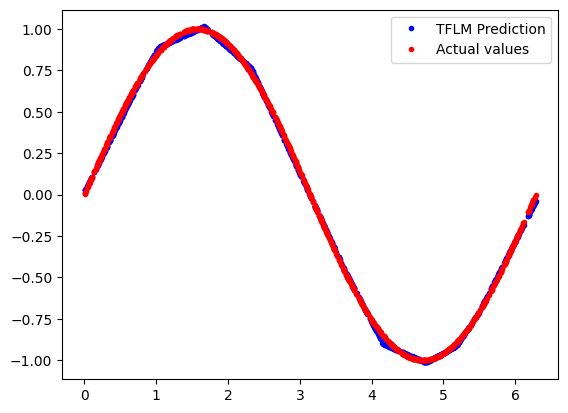
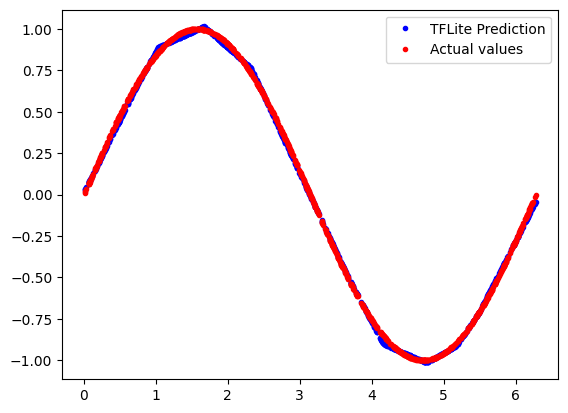

<!-- mdformat off(b/169948621#comment2) -->
<!-- 翻译：AI助手，于 2026年5月13日 -->
<!-- 格式：中英文对照，便于学习 -->

# Hello World 示例
# Hello World Example

此示例旨在展示使用 [TensorFlow Lite for Microcontrollers](https://www.tensorflow.org/lite/microcontrollers) 的绝对基础知识。它包括训练模型、将其转换为用于 TensorFlow Lite for Microcontrollers 的完整端到端工作流程，以便在微控制器上运行推理。
This example is designed to demonstrate the absolute basics of using [TensorFlow
Lite for Microcontrollers](https://www.tensorflow.org/lite/microcontrollers).
It includes the full end-to-end workflow of training a model, converting it for
use with TensorFlow Lite for Microcontrollers for running inference on a
microcontroller.

## 目录
## Table of contents

-   [在开发机器上运行 evaluate.py 脚本](#run-the-evaluate-script-on-a-development-machine)
-   [Run the evaluate.py script on a development machine](#run-the-evaluate-script-on-a-development-machine)
-   [在开发机器上运行测试](#run-the-tests-on-a-development-machine)
-   [Run the tests on a development machine](#run-the-tests-on-a-development-machine)
-   [训练你自己的模型](#train-your-own-model)
-   [Train your own model](#train-your-own-model)

## 在开发机器上运行 evaluate.py 脚本
## Run the evaluate.py script on a development machine

evaluate.py 脚本使用 [0, 2*PI] 范围内的 x_values 运行 hello_world.tflite 模型。该脚本绘制了使用 TFLM 解释器预测的正弦波值图，并将该预测与 numpy 库生成的实际值进行比较。
The evaluate.py script runs the hello_world.tflite model with x_values in the 
range of [0, 2*PI]. The script plots a diagram of the predicted value of sinwave
using TFLM interpreter and compare that prediction with the actual value
generated by the numpy lib.

```bash
bazel build tensorflow/lite/micro/examples/hello_world:evaluate
bazel run tensorflow/lite/micro/examples/hello_world:evaluate
bazel run tensorflow/lite/micro/examples/hello_world:evaluate -- --use_tflite
```

   
   

## 在开发机器上运行 evaluate_test.py 脚本
## Run the evaluate_test.py script on a development machine

这些测试验证 hello_world.tflite 模型的输入/输出以及预测。还有一个测试通过同时运行 TFLM 和 TFlite 解释器，然后比较两个解释器的预测来验证模型的正确性。
These tests verify the input/output as well as the prediction of the
hello_world.tflite model. There is a test to also verify the correctness of
the model by running both TFLM and TFlite interpreter and then comparing the
prediction from both interpreters.

```bash
bazel build tensorflow/lite/micro/examples/hello_world:evaluate_test
bazel run tensorflow/lite/micro/examples/hello_world:evaluate_test
```

## 在开发机器上运行测试
## Run the tests on a development machine

使用 bazel 运行 cc 测试：
Run the cc test using bazel

```bash
bazel run tensorflow/lite/micro/examples/hello_world:hello_world_test
```

以及使用 make 运行：
And to run it using make 

```bash
make -f tensorflow/lite/micro/tools/make/Makefile test_hello_world_test
```

测试的源代码是 [hello_world_test.cc](hello_world_test.cc)。它是相当少量的代码，创建一个解释器，获取已编译到程序中的模型的句柄，然后使用模型和样本输入调用解释器。
The source for the test is [hello_world_test.cc](hello_world_test.cc).
It's a fairly small amount of code that creates an interpreter, gets a handle to
a model that's been compiled into the program, and then invokes the interpreter
with the model and sample inputs.

## 训练你自己的模型
## Train your own model

到目前为止，您已经使用现有的训练模型在微控制器上运行推理。如果您希望训练自己的模型，以下是可以帮助您实现这一目标的脚本。
So far you have used an existing trained model to run inference on
microcontrollers. If you wish to train your own model, here are the scripts 
that can help you to achieve that. 

```bash
bazel build tensorflow/lite/micro/examples/hello_world:train
```

并运行它：
And to run it

```bash
bazel-bin/tensorflow/lite/micro/examples/hello_world/train --save_tf_model 
--save_dir=/tmp/model_created/
```

上述脚本将在 `/tmp/model_created` 目录内创建一个 TF 模型和 TFlite 模型。
The above script will create a TF model and TFlite model inside the 
`/tmp/model_created` directory. 

现在上面的模型是一个 `float` 模型。这意味着它可以接受浮点输入并产生浮点输出。
Now the above model is a `float` model. This means it can take floating point input
and can produce floating point output. 

如果我们想要一个完全量化的模型，我们可以使用 quantization 目录中的 `ptq.py` 脚本。`ptq.py` 脚本可以接受一个浮点 TF 模型并产生一个量化模型。
If we want a fully quantized model we can use the `ptq.py` script inside the 
quantization directory. The `ptq.py` script can take a floating point TF model 
and can produce a quantized model.

构建 `ptq.py` 脚本：
Build the `ptq.py` script like

```bash
bazel build tensorflow/lite/micro/examples/hello_world/quantization:ptq
```

然后我们可以运行 `ptq` 脚本将浮点模型转换为量化模型，如下所示。请注意，我们在这里使用 TF 模型的目录 (`/tmp/model_created`) 作为 source_model_dir。量化模型（名为 `hello_world_int8.tflite`）将在 target_dir 内创建。`ptq.py` 脚本将转换 `/tmp/model_created` 文件夹中找到的 `TF 模型`，并将其转换为 `int8` TFlite 模型。
Then we can run the `ptq` script to convert the float model to quantized model as 
follows. Note that we are using the directory (`/tmp/model_created`) of the 
TF model as the source_model_dir here. The quantized model 
(named `hello_world_int8.tflite`) will be created inside the target_dir.
The `ptq.py` script will convert the `TF model` found inside the 
`/tmp/model_created` folder and convert it to an `int8` TFlite model.

```bash
bazel-bin/tensorflow/lite/micro/examples/hello_world/quantization/ptq  
--source_model_dir=/tmp/model_created --target_dir=/tmp/quant_model/
```