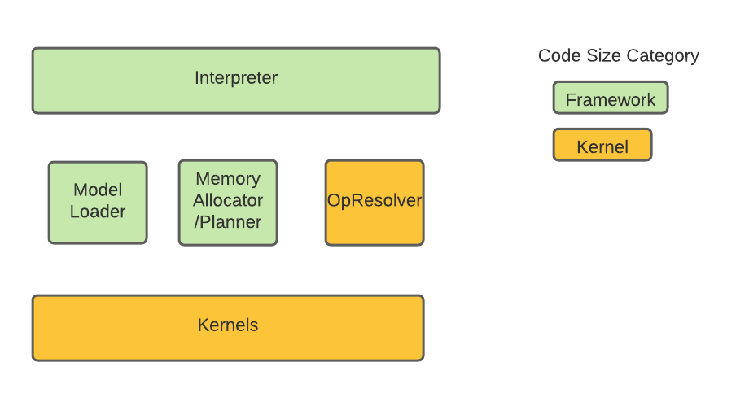

<!--ts-->
<!-- 翻译：AI助手，于 2026年5月13日 -->
<!-- 格式：中英文对照，便于学习 -->

*   [TFLM 代码大小常见问题解答](#tflm-code-size-faq)
*   [TFLM Code Size FAQ](#tflm-code-size-faq)
    *   [估算 TFLM 代码大小的方法](#methodology-to-estimate-code-size-of-tflm)
    *   [Methodology to estimate code size of TFLM](#methodology-to-estimate-code-size-of-tflm)
    *   [TFLM 框架的示例代码大小](#sample-code-size-of-the-tflm-framework)
    *   [Sample code size of the TFLM Framework](#sample-code-size-of-the-tflm-framework)
    *   [改善代码大小的技巧](#tips-to-improve-code-size)
    *   [Tips to improve code size](#tips-to-improve-code-size)
        *   [仅注册模型所需的内核](#only-register-kernels-that-a-model-needs)
        *   [Only register kernels that a model needs](#only-register-kernels-that-a-model-needs)

<!-- Added by: deqiangc, at: Mon 27 Sep 2021 05:44:45 PM PDT -->
<!-- 翻译：AI助手，于 2026年5月13日 -->

<!--te-->

# TFLM 代码大小常见问题解答
# TFLM Code Size FAQ

本文档概述了测量 TFLM 代码大小的基本步骤。在基于 ELF 文件格式的平台上，代码大小指的是 ELF 文件的文本段大小。此外，本文档概述了一些保持代码小巧的常见技巧。
This document outlines basic steps to measure the code size of TFLM. On a
platform based on ELF file format, the code size refers to the text section size
of an ELF file. Additionally, this document outlines some common tips to keep
the code size small.

请注意，依赖于 TFLM 的完整应用程序通常还会包括 flatbuffer 格式的 TFLite 模型和内存竞技场，它们位于 ELF 文件的数据段中。它们的大小对整体内存占用很重要，但本文档不讨论这些。
Note that a complete application that depends on the TFLM typically would also
include a TFLite model in flatbuffer and a memory arena, which are in data
sections of an ELF file. Their size is an important aspect to the overall memory
footprint, but not discussed in this document.

## 估算 TFLM 代码大小的方法
## Methodology to estimate code size of TFLM

基于[架构描述](https://arxiv.org/pdf/2010.08678.pdf)，我们进一步将源代码分为两类：TFLM 框架和内核，如下图所示：
Based on the [architecture description](https://arxiv.org/pdf/2010.08678.pdf),
we further classify the source code into two categories: TFLM framework and
kernels as illustrated in the below diagram:

TFLM 框架包括解释器、内存规划器等基础设施。TFLM 框架的大小是使用 TFLM 的固定成本，主要包括 tensorflow/lite/micro 下的代码，但不包括 tensorflow/lite/micro/kernels 中的代码。
TFLM Framework includes infrastructure such as interpreter, memory planner etc.
The size of TFLM Framework is a fixed cost of using TFLM and primarily includes
codes under tensorflow/lite/micro, but excludes those in
tensorflow/lite/micro/kernels.

另一方面，内核的代码大小贡献取决于应用程序使用的模型，并随模型而变化。内核的贡献主要包括 tensorflow/lite/micro/kernels 中的代码以及第三方库。
On the other hand, the code size contribution from the kernels depends on and
scales with the model that an application uses. This contribution from the
kernels mostly includes the codes in tensorflow/lite/micro/kernels as well as
third party libraries.

为了测量独立于模型的 TFLM 框架大小，本文档采用的方法如下：
To measure the size of the TFLM Framework that is independent of a model, the
methodology that is adopted in this document is as follows:

1.  构建 `tensorflow/lite/micro/examples/memory_footprint/` 中的 `baseline_memory_footprint` 目标。通过 `size` 命令估算其代码大小。
1.  Build the `baseline_memory_footprint` target in
    `tensorflow/lite/micro/examples/memory_footprint/`. Estimate its code size
    via a `size` command.
2.  构建 `tensorflow/lite/micro/examples/memory_footprint/` 中的 `interpreter_memory_footprint` 目标。通过 `size` 命令估算其代码大小。
1.  Build the `interpreter_memory_footprint` target in
    `tensorflow/lite/micro/examples/memory_footprint/`. Estimate its code size
    via a `size` command.
3.  从上述两个步骤中减去两个大小，得到 TFLM 框架的代码大小估算。
1.  Subtract the two sizes from the above two steps provides the code size
    estimation of the TFLM Framework.

步骤 1 给出了“无操作应用程序”的代码大小，通常包括平台特定的初始化。我们假设这是一个独立于 TFLM 的固定大小。
Step 1 gives the code size for a "no-op application" that would typically
include platform-specific initialization. We assume that this is a fixed size
that is independent of TFLM.

步骤 2 生成的二进制文件包括创建解释器实例（即 TFLM 框架）所需的代码。它明确避免引入任何内核代码，因此步骤 2 和步骤 1 之间的增加是 TFLM 框架占用空间的合理估计。请注意，由于我们没有注册任何内核代码，步骤 2 的二进制文件无法运行任何实际的推理。
Step 2 produces a binary that includes the code needed to create an interpreter
instance (i.e. the TFLM framework). It explicitly avoids pulling in any kernel
code such that the increase between step 2 and step 1 is a reasonable estimate
of the footprint of the TFLM framework. Note that since we do not register any
kernel code, the binary from step 2 can not run any actual inference.

通过上述步骤的代码大小估算还包括由于使用 TFLM 而需要引入的额外系统库。
The code size estimation via the above steps also include additional system
libraries that need to be pulled in due the use of the TFLM.

可以采用类似的过程进一步估算内核的大小。例如，关键词检测中使用内核的大小可以通过以下步骤估算：
A similar process can be adopted to further estimate the size of kernels. For
example, the size of kernels used in keyword detection can be estimated by the
following steps

1.  构建 `tensorflow/lite/micro/benchmarks` 中的 `keyword_benchmark` 目标。通过 `size` 命令估算其代码大小。
1.  Build the `keyword_benchmark` target in `tensorflow/lite/micro/benchmarks`.
    Estimate its code size via a `size` command.
2.  减去 `keyword_benchmark` 和 `interpreter_memory_footprint` 之间的代码大小差。
1.  Subtract to get the code size difference between the `keyword_benchmark` and
    `interpreter_memory_footprint`

值得注意的是，上述方法将把 `MicroMutableOpResolver` 的代码大小归因于内核的代码大小，而不是将它们计入 TFLM 框架的代码大小估算中。我们采用这种方法是因为其简单性、鲁棒性以及包含系统库贡献的能力。
It may be worth noting that the above methodology will attribute the code size
from `MicroMutableOpResolver` towards the code size of kernels, instead of
counting them in the code size estimation of the TFLM Framework. We adopt this
methodology due to its simplicity, robustness and the ability to include the
contribution of system libraries.

## TFLM 框架的示例代码大小
## Sample code size of the TFLM Framework

以下 TFLM 框架的代码大小数字仅供参考。
The below code size number of the TFLM Framework is shown as references only.

对于 64 位 x86 平台，通过上述方法获得的 TFLM 代码大小为 20411 字节。
For a 64 bit x86 platform, the TFLM code size obtained through the above method
is 20411 bytes.

对于嵌入式 bluepill ARM 平台，通过上述方法获得的 TFLM 代码大小为 9732 字节。
For an embedded bluepill ARM platform, the TFLM code size obtained through the
above method is 9732 bytes.

## 改善代码大小的技巧
## Tips to improve code size

### 仅注册模型所需的内核
### Only register kernels that a model needs

导致不必要的大代码大小的一个常见问题是忘记仅注册模型所需的内核，最终注册了所有内核。
One common issue that leads to unnecessary large code size is forgetting to only
register only kernels that a model needs and ending up registering all kernels.

因此，在脱离探索阶段时，最好仅注册模型所需的内核，而不是所有内核。
Therefore, when moving off the exploration stage, it is better to only register
kernels that a model needs, rather than all kernels.