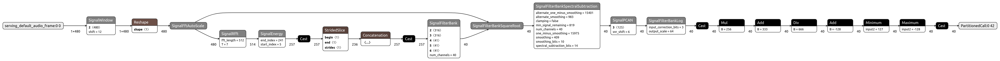

<!-- mdformat off(b/169948621#comment2) -->
<!-- 翻译：AI助手，于 2026年5月13日 -->
<!-- 格式：中英文对照，便于学习 -->

# Micro Speech 示例
# Micro Speech Example

此示例展示如何使用 TensorFlow Lite Micro (TFLM) 在两个模型上运行推理以进行唤醒词识别。第一个模型是音频预处理器，从原始音频样本生成频谱图数据。第二个是 Micro Speech 模型，一个小于 20 kB 的模型，可以从语音数据中识别两个关键词："yes" 和 "no"。Micro Speech 模型将频谱图数据作为输入并产生类别概率。
This example shows how to run inference using TensorFlow Lite Micro (TFLM)
on two models for wake-word recognition.
The first model is an audio preprocessor that generates spectrogram data
from raw audio samples.
The second is the Micro Speech model, a less than 20 kB model
that can recognize 2 keywords, "yes" and "no", from speech data.
The Micro Speech model takes the spectrogram data as input and produces
category probabilities.

## 目录
## Table of contents

-   [音频预处理器](#音频预处理器)
-   [Audio Preprocessor](#audio-preprocessor)
-   [Micro Speech 模型架构](#micro-speech-模型架构)
-   [Micro Speech Model Architecture](#micro-speech-model-architecture)
-   [在开发机器上运行 C++ 测试](#在开发机器上运行-c-测试)
-   [Run the C++ tests on a development machine](#run-the-c-tests-on-a-development-machine)
-   [在开发机器上运行 evaluate.py 脚本](#在开发机器上运行-evaluatepy-脚本)
-   [Run the evaluate.py script on a development machine](#run-the-evaluatepy-script-on-a-development-machine)
-   [在开发机器上运行 evaluate_test.py 脚本](#在开发机器上运行-evaluate_testpy-脚本)
-   [Run the evaluate_test.py script on a development machine](#run-the-evaluate_testpy-script-on-a-development-machine)
-   [将模型或音频样本转换为 C++](#将模型或音频样本转换为-c)
-   [Converting models or audio samples to C++](#converting-models-or-audio-samples-to-c)
-   [训练自己的模型](#训练自己的模型)
-   [Train your own model](#train-your-own-model)

## 音频预处理器
## Audio Preprocessor

音频预处理器模型将原始音频样本转换为频谱图特征。音频样本以窗口帧的形式输入到模型中，每个窗口与上一个窗口重叠。当累积了足够的特征时，这些特征可以作为 Micro Speech 模型的输入。
The Audio Preprocessor model converts raw audio samples into a spectrographic feature.
Audio samples are input to the model in windowed frames, each window overlapping
the previous.  When sufficient features have been accumulated, those features can
be provided as input to the Micro Speech model.

此模型提供了在 Micro Speech 模型训练期间使用的传统预处理的复制。有关训练期间音频预处理的更多信息，请参阅 [训练 README](train/README.md#preprocessing-speech-input) 文档。
This model provides a replication of the legacy preprocessing used during training
of the Micro Speech model.  For additional information on audio preprocessing during training,
please refer to the [training README](train/README.md#preprocessing-speech-input) documentation.

在 [models](models/) 目录中提供了提供 `int8` 和 `float32` 输出的音频预处理模型，准备与 Micro Speech 模型一起使用。这些模型期望音频输入符合以下要求：
Audio Preprocessing models providing `int8` and `float32` output, ready for use
with the Micro Speech model, are provided in the [models](models/) directory.
These models expect the audio input to conform to:

* 30ms 窗口帧
* 30ms window frame
* 20ms 窗口步长
* 20ms window stride
* 16KHz 采样率
* 16KHz sample rate
* 16 位有符号 PCM 数据
* 16-bit signed PCM data
* 单声道（单通道）
* single channel (mono)

### 模型架构
### Model Architecture

此模型主要由 [信号库](https://github.com/tensorflow/tflite-micro/blob/main/python/tflite_micro/signal) 操作组成。该库是一组 Python 方法和 `C++` 库代码的绑定。为了允许与 `TFLM MicroInterpreter` 一起使用，还提供了一组 [信号库内核](https://github.com/tensorflow/tflite-micro/blob/main/signal/micro/kernels)。
This model consists primarily of [Signal Library](https://github.com/tensorflow/tflite-micro/blob/main/python/tflite_micro/signal) operations.
The library is a set of Python methods, and bindings to `C++` library code.
To allow for use with the `TFLM MicroInterpreter`, a set of [Signal Library kernels](https://github.com/tensorflow/tflite-micro/blob/main/signal/micro/kernels)
is also provided.

[audio_preprocessor.py](audio_preprocessor.py) 脚本提供了如何在您自己的 Python 应用程序中使用 `信号库` 的完整示例。此脚本支持 TensorFlow 即时执行模式、图执行模式和 `TFLM MicroInterpreter` 推理操作。
The [audio_preprocessor.py](audio_preprocessor.py) script provides a complete example
of how to use the `Signal Library` within your own Python application.  This script
has support for TensorFlow eager-execution mode, graph-execution mode, and
`TFLM MicroInterpreter` inference operations.

[](images/audio_preprocessor_int8.png)
[](images/audio_preprocessor_int8.png)

*此图像是通过在 [Netron](https://github.com/lutzroeder/netron) 中可视化 'models/audio_preprocessor_int8.tflite' 文件得到的*
*This image was derived from visualizing the 'models/audio_preprocessor_int8.tflite' file in
[Netron](https://github.com/lutzroeder/netron)*

模型执行的每个步骤概述如下：
Each of the steps performed by the model are outlined as follows:

1) 音频帧输入，形状为 `(1, 480)`
1) Audio frame input with shape `(1, 480)`
2) 使用 `SignalWindow` 应用 `Hann 窗口` 平滑
1) Apply `Hann Window` smoothing using `SignalWindow`
3) 重塑张量以匹配 `SignalFftAutoScale` 的输入
1) Reshape tensor to match the input of `SignalFftAutoScale`
4) 使用 `SignalFftAutoScale` 重新缩放张量数据并计算 `SignalFilterBankSquareRoot` 的输入参数之一
1) Rescale tensor data using `SignalFftAutoScale` and calculate one of the input
parameters to `SignalFilterBankSquareRoot`
5) 使用 `SignalRfft` 计算 FFT
1) Compute FFT using `SignalRfft`
6) 使用 `SignalEnergy` 计算功率谱。张量数据仅更新 `[start_index, end_index)` 之间的元素。
1) Compute power spectrum using `SignalEnergy`.  The tensor data is only updated
for elements between `[start_index, end_index)`.
7) `Cast`、`StridedSlice` 和 `Concatenation` 操作用于用零填充张量数据，对于 `[start_index, end_index)` 之外的元素
1) The `Cast`, `StridedSlice`, and `Concatenation` operations are used to fill
the tensor data with zeros, for elements outside of `[start_index, end_index)`
8) 使用 `SignalFilterBank` 将功率谱张量数据压缩到仅 40 个通道（频带）
1) Compress the power spectrum tensor data into just 40 channels (frequency bands)
using `SignalFilterBank`
9) 使用 `SignalFilterBankSquareRoot` 缩小张量数据
1) Scale down the tensor data using `SignalFilterBankSquareRoot`
10) 使用 `SignalFilterBankSpectralSubtraction` 应用噪声消除
1) Apply noise reduction using `SignalFilterBankSpectralSubtraction`
11) 使用 `SignalPCAN` 应用增益控制
1) Apply gain control using `SignalPCAN`
12) 使用 `SignalFilterBankLog` 缩小张量数据
1) Scale down the tensor data using `SignalFilterBankLog`
13) 剩余的操作执行额外的传统缩小并将张量数据转换为 `int8`
1) The remaining operations perform additional legacy down-scaling and convert
the tensor data to `int8`
14) 模型输出形状为 `(40,)`
1) Model output has shape `(40,)`

### `FeatureParams` Python 类
### The `FeatureParams` Python Class

`FeatureParams` 类位于 [audio_preprocessor.py](audio_preprocessor.py#L260) 脚本中。此类允许自定义配置 `AudioPreprocessor` 类。可以配置采样率、窗口大小、窗口步长、输出通道数等参数。要更改的参数必须在类实例化期间设置，之后冻结。`FeatureParams` 的默认值与 Micro Speech 模型训练期间使用的传统音频预处理匹配。
The `FeatureParams` class is located within the [audio_preprocessor.py](audio_preprocessor.py#L260)
script.  This class allows for custom configuration of the `AudioPreprocessor` class.
Parameters such as sample rate, window size, window stride, number of output channels,
and many more can be configured.  The parameters to be changed must be set during
class instantiation, and are frozen thereafter.  The defaults for `FeatureParams`
match those of the legacy audio preprocessing used during Micro Speech model training.

### `AudioPreprocessor` Python 类
### The `AudioPreprocessor` Python Class

[audio_preprocessor.py](audio_preprocessor.py#L338) 脚本中的 `AudioPreprocessor` 类提供了易于使用的便捷方法来创建和使用音频预处理模型。此类通过使用 `FeatureParams` 对象进行配置，允许在音频预处理模型的工作方式上具有一定的灵活性。
The `AudioPreprocessor` class in the [audio_preprocessor.py](audio_preprocessor.py#L338)
script provides easy to use convenience methods for creating
and using an audio preprocessing model.  This class is configured through use of
a `FeatureParams` object, allowing some flexibility in how the audio preprocessing
model works.

可用方法和属性的简短摘要：
A short summary of the available methods and properties:

* `load_samples`：从 `WAV` 格式文件加载音频样本并准备样本供其他 `AudioPreprocessor` 方法使用
* `load_samples`: load audio samples from a `WAV` format file and prepare
the samples for use by other `AudioPreprocessor` methods
* `samples`：包含先前加载的音频样本的张量
* `samples`: tensor containing previously loaded audio samples
* `params`：类实例化时使用的 `FeatureParams` 对象
* `params`: the `FeatureParams` object the class was instantiated with
* `generate_feature`：使用 TensorFlow 即时执行生成单个特征
* `generate_feature`: generate a single feature using TensorFlow eager-execution
* `generate_feature_using_graph`：使用 TensorFlow 图执行生成单个特征
* `generate_feature_using_graph`: generate a single feature using TensorFlow graph-execution
* `generate_feature_using_tflm`：使用 `TFLM MicroInterpreter` 生成单个特征
* `generate_feature_using_tflm`: generate a single feature using the `TFLM MicroInterpreter`
* `reset_tflm`：重置 `TFLM MicroInterpreter` 和 `Signal Library` 操作的内部状态
* `reset_tflm`: reset the internal state of the `TFLM MicroInterpreter` and the
`Signal Library` operations
* `generate_tflite_file`：为预处理器模型创建 `.tflite` 格式文件
* `generate_tflite_file`: create a `.tflite` format file for the preprocessor model

### 在开发机器上运行 audio_preprocessor.py 脚本
### Run the audio_preprocessor.py script on a development machine

[audio_preprocessor.py](audio_preprocessor.py#L532) 脚本为预处理模型生成 `.tflite` 文件，准备与 Micro Speech 模型一起使用。
The [audio_preprocessor.py](audio_preprocessor.py#L532) script generates a `.tflite`
file for the preprocessing model, ready for use with the Micro Speech model.

要生成具有 `int8` 输出的 `.tflite` 模型文件：
To generate a `.tflite` model file with `int8` output:

```bash
bazel build tensorflow/lite/micro/examples/micro_speech:audio_preprocessor
bazel-bin/tensorflow/lite/micro/examples/micro_speech/audio_preprocessor --output_type=int8
```

要生成具有 `float32` 输出的 `.tflite` 模型文件：
To generate a `.tflite` model file with `float32` output:

```bash
bazel build tensorflow/lite/micro/examples/micro_speech:audio_preprocessor
bazel-bin/tensorflow/lite/micro/examples/micro_speech/audio_preprocessor --output_type=float32
```

### 在开发机器上运行 audio_preprocessor_test.py 脚本
### Run the audio_preprocessor_test.py script on a development machine

[audio_preprocessor_test.py](audio_preprocessor_test.py) 脚本执行多个测试，以确保在所有执行模式下发生正确的推理操作。测试包括：
The [audio_preprocessor_test.py](audio_preprocessor_test.py) script performs
several tests to ensure correct inference operations occur across all execution modes.
The tests are:

* 在即时、图和 `TFLM MicroInterpreter` 执行模式之间交叉检查推理结果
* cross-check inference results between eager, graph, and `TFLM MicroInterpreter`
execution modes
* 检查 [testdata](testdata/) 目录中的 `yes` 和 `no` 30ms 样本，以正确生成特征张量
* check the `yes` and `no` 30ms samples in the [testdata](testdata/) directory for
correct generation of the feature tensor
* 将预处理器 `int8` 模型与 [models](models/) 目录中的相同模型进行比较
* compare the preprocessor `int8` model against the same model in the [models](models/) directory
* 将预处理器 `float32` 模型与 [models](models/) 目录中的相同模型进行比较
* compare the preprocessor `float32` model against the same model in the [models](models/) directory

```bash
bazel build tensorflow/lite/micro/examples/micro_speech:audio_preprocessor_test
bazel-bin/tensorflow/lite/micro/examples/micro_speech/audio_preprocessor_test
```

## Micro Speech 模型架构
## Micro Speech Model Architecture

这是一个简单的模型，由卷积 2D 层、全连接层或 MatMul 层（输出：logits）和 Softmax 层（输出：概率）组成，如下所示。请参阅 [`tiny_conv`](https://github.com/tensorflow/tensorflow/blob/master/tensorflow/examples/speech_commands/models.py#L673) 以获取更多详细信息。
This is a simple model comprised of a Convolutional 2D layer, a Fully Connected
Layer or a MatMul Layer (output: logits) and a Softmax layer
(output: probabilities) as shown below. Refer to the [`tiny_conv`](https://github.com/tensorflow/tensorflow/blob/master/tensorflow/examples/speech_commands/models.py#L673) for more details.