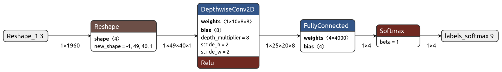

<!--ts-->
<!-- 翻译：AI助手，于 2026年5月12日 -->
<!--te-->

# 微型语音训练
# Micro Speech Training

此示例展示如何训练一个小于 20 kB 的模型，该模型可以从语音数据中识别两个关键词 "yes" 和 "no"。
This example shows how to train a less than 20 kB model that can recognize 2 keywords,
"yes" and "no", from speech data.

如果输入不属于任何类别，则分类为 "unknown"；如果输入是静音，则分类为 "silence"。
If the input does not belong to either categories, it is classified as "unknown"
and if the input is silent, it is classified as "silence".

您可以重新训练它来识别此列表中的任意组合的单词（2 个或更多）：
You can retrain it to recognize any combination of words (2 or more) from this
list:

```
yes
no
up
down
left
right
on
off
stop
go
```

用于训练模型的脚本源自[简单音频识别](https://www.tensorflow.org/tutorials/audio/simple_audio)教程。
The scripts used in training the model have been sourced from the
[Simple Audio Recognition](https://www.tensorflow.org/tutorials/audio/simple_audio)
tutorial.

## 目录
## Table of contents

-   [概述](#概述)
-   [Overview](#overview)
-   [训练](#训练)
-   [Training](#training)
-   [训练好的模型](#训练好的模型)
-   [Trained Models](#trained-models)
-   [模型架构](#模型架构)
-   [Model Architecture](#model-architecture)
-   [数据集](#数据集)
-   [Dataset](#dataset)
-   [预处理语音输入](#预处理语音输入)
-   [Preprocessing Speech Input](#preprocessing-speech-input)
-   [其他训练方法](#其他训练方法)
-   [Other Training Methods](#other-training-methods)

## 概述
## Overview

1.  数据集：Speech Commands, Version 2.
    ([下载链接](https://storage.cloud.google.com/download.tensorflow.org/data/speech_commands_v0.02.tar.gz),
    [论文](https://arxiv.org/abs/1804.03209))
1.  Dataset: Speech Commands, Version 2.
    ([Download Link](https://storage.cloud.google.com/download.tensorflow.org/data/speech_commands_v0.02.tar.gz),
    [Paper](https://arxiv.org/abs/1804.03209))
2.  数据集类型：**Speech**
2.  Dataset Type: **Speech**
3.  深度学习框架：**TensorFlow 1.5**
3.  Deep Learning Framework: **TensorFlow 1.5**
4.  语言：**Python 3.7**
4.  Language: **Python 3.7**
5.  模型大小：**<20 kB**
5.  Model Size: **<20 kB**
6.  模型类别：**多类分类**
6.  Model Category: **Multiclass Classification**

## 训练
## Training

使用 Google Colaboratory 在云端训练模型，或使用 Jupyter Notebook 在本地训练。
Train the model in the cloud using Google Colaboratory or locally using a
Jupyter Notebook.

<table class="tfo-notebook-buttons" align="left">
  <td>
    <a target="_blank" href="https://colab.research.google.com/github/tensorflow/tflite-micro/blob/main/tensorflow/lite/micro/examples/micro_speech/train/train_micro_speech_model.ipynb">Google Colaboratory</a>
  </td>
  <td>
    <a target="_blank" href="https://github.com/tensorflow/tflite-micro/blob/main/tensorflow/lite/micro/examples/micro_speech/train/train_micro_speech_model.ipynb">Jupyter Notebook</a>
  </td>
</table>

*预计训练时间：约 2 小时。*
*Estimated Training Time: ~2 Hours.*

有关更多选项，请参阅[其他训练方法](#其他训练方法)部分。
For more options, refer to the [Other Training Methods](#other-training-methods)
section.

## 训练好的模型
## Trained Models

| 下载链接 | [speech_commands.zip](https://storage.googleapis.com/download.tensorflow.org/models/tflite/micro/micro_speech_2020_04_13.zip) |
| ------------- |-------------|

上述 zip 文件中的 `models` 目录可以通过按照上面[训练](#训练)部分中的说明生成。它包括以下 3 个模型文件：
The `models` directory in the above zip file can be generated by following the
instructions in the [Training](#training) section above. It
includes the following 3 model files:

| 名称 | 格式 | 目标框架 | 目标设备 |
| :------------- | :----------- | :--------------- | :------------------------ |
| `model.pb` | 冻结的 GraphDef | TensorFlow | 大规模/云/服务器 |
| `model.tflite` *(<20 kB)* | 完全量化的 TFLite 模型* | TensorFlow Lite | 移动设备 |
| `model.cc` | C 源文件 | 用于微控制器的 TensorFlow Lite | 微控制器 |

**完全量化意味着模型是**严格 int8 量化**的，**包括**输入和输出。*
**Fully quantized implies that the model is **strictly int8** quantized
**including** the input(s) and output(s).*

## 模型架构
## Model Architecture

这是一个简单的模型，包含一个卷积 2D 层、一个全连接层或矩阵乘法层（输出：logits）和一个 Softmax 层（输出：概率），如下所示。请参考 [`tiny_conv`](https://github.com/tensorflow/tensorflow/blob/master/tensorflow/examples/speech_commands/models.py#L673) 模型架构。
This is a simple model comprised of a Convolutional 2D layer, a Fully Connected
Layer or a MatMul Layer (output: logits) and a Softmax layer
(output: probabilities) as shown below. Refer to the [`tiny_conv`](https://github.com/tensorflow/tensorflow/blob/master/tensorflow/examples/speech_commands/models.py#L673)
model architecture.

[](../images/micro_speech_quantized.png)

*此图像是通过在 [Netron](https://github.com/lutzroeder/netron) 中可视化 'models/micro_speech_quantized.tflite' 文件得到的*
*This image was derived from visualizing the 'models/micro_speech_quantized.tflite' file in
[Netron](https://github.com/lutzroeder/netron)*

这不会产生一个高度准确的模型，但它被设计为管道的第一阶段，在低能耗的硬件上运行，该硬件可以始终处于开启状态，然后在发现可能的语音时唤醒更高功率的芯片，以便进行更准确的分析。此外，模型接受预处理的语音输入，因此我们可以利用更简单的模型进行推理。
This doesn't produce a highly accurate model, but it's designed to be used as
the first stage of a pipeline, running on a low-energy piece of hardware that
can always be on, and then wake higher-power chips when a possible utterance has
been found, so that more accurate analysis can be done. Additionally, the model
takes in preprocessed speech input as a result of which we can leverage a
simpler model for inference results.

## 数据集
## Dataset

Speech Commands 数据集。([下载链接](https://storage.cloud.google.com/download.tensorflow.org/data/speech_commands_v0.02.tar.gz), [论文](https://arxiv.org/abs/1804.03209)) 包含超过 105,000 个 WAVE 音频文件，人们说着三十个不同的单词。这些数据由 Google 收集，并在 CC BY 许可下发布。您可以通过贡献五分钟自己的声音来帮助改进它。存档超过 2GB，因此这部分可能需要一些时间，但您应该会看到进度日志，并且一旦下载完成，您就不需要再次执行此操作。
The Speech Commands Dataset. ([Download Link](https://storage.cloud.google.com/download.tensorflow.org/data/speech_commands_v0.02.tar.gz),
[Paper](https://arxiv.org/abs/1804.03209)) consists of over 105,000 WAVE audio
files of people saying thirty different words. This data was collected by
Google and released under a CC BY license. You can help improve it by
contributing five minutes of your own voice. The archive is over 2GB, so this
part may take a while, but you should see progress logs, and once it's been
downloaded you won't need to do this again.

## 预处理语音输入
## Preprocessing Speech Input

在本节中，我们讨论频谱图，即模型的预处理语音输入。
In this section we discuss spectrograms, the preprocessed speech input to the
model.

模型不接受原始音频样本数据，而是使用频谱图，这些频谱图是由不同时间窗口获取的频率信息切片组成的二维数组。
The model doesn't take in raw audio sample data, instead it works with
spectrograms which are two dimensional arrays that are made up of slices of
frequency information, each taken from a different time window.

创建频谱图数据的方法是：通过对音频样本数据的 30ms 窗口运行 FFT 来创建每个频率切片。输入样本被视为介于 -1 和 +1 之间的实数值（在 16 位有符号整数样本中编码为 -32,768 和 32,767）。音频采样窗口步长为 20ms，因此每个窗口重叠 10ms。
The recipe for creating the spectrogram data is that each frequency slice is
created by running an FFT across a 30ms window of the audio sample data. The
input samples are treated as being between -1 and +1 as real values (encoded as
-32,768 and 32,767 in 16-bit signed integer samples).  The audio sampling window
stride is 20ms, thus every window overlaps by 10ms.

这导致 FFT 有 257 个条目。每大约六个条目被平均在一起，给出切片中总共 40 个频率桶。结果通过降尺度、噪声抑制、自动增益控制和最终降尺度进一步处理。
This results in an FFT with 257 entries. Every sequence of approximately six entries is
averaged together, giving a total of 40 frequency buckets in the slice.
The results are further processed by down-scaling, noise reduction, automatic
gain control, and a final down-scaling.

每个相邻的频率条目按升序内存顺序存储（频率桶 0 在 data[0]，桶 1 在 data[1]，等等）。然后频率分析窗口向前移动 20ms，重复该过程，将新频率切片的结果存储在下一个内存行中。训练配置为 1000ms 长度的原始音频样本。窗口大小为 30ms，步长为 20ms，可以从 1000ms 的音频数据中创建大约 49 个频率切片。因此，预处理产生一个单通道图像，宽度为 40 像素，高度为 49 行。
Each adjacent frequency entry is stored in ascending memory order (frequency
bucket 0 at data[0], bucket 1 at data[1], etc). The window for the frequency
analysis is then moved forward by 20ms, and the process repeated, storing the
results of the new frequency slice in the next memory row.
The training is configured for raw audio samples of 1000ms in length.
With a window size of 30ms and stride of 20ms, some 49 frequency slices can
be created from 1000ms of audio data.
Thus, the preprocessing produces a
single channel image that is 40 pixels wide, and 49 rows high.

## 其他训练方法
## Other Training Methods

### 使用 [Google Cloud](https://cloud.google.com/)。
### Use [Google Cloud](https://cloud.google.com/).

*注意：Google Cloud 不是免费的。您需要根据使用 VM 的时间长短和使用的资源付费。*
*Note: Google Cloud isn't free. You need to pay depending on how long you use
run the VM and what resources you use.*

1. 使用预配置的深度学习 VM 映像创建虚拟机 (VM)。
1. Create a Virtual Machine (VM) using a pre-configured Deep Learning VM Image.

```bash
export IMAGE_FAMILY="tf-latest-cpu"
export ZONE="us-west1-b" # 或任何其他所需区域
export ZONE="us-west1-b" # Or any other required region
export INSTANCE_NAME="model-trainer"
export INSTANCE_TYPE="n1-standard-8" # 或任何其他实例类型
export INSTANCE_TYPE="n1-standard-8" # or any other instance type
gcloud compute instances create $INSTANCE_NAME \
        --zone=$ZONE \
        --image-family=$IMAGE_FAMILY \
        --image-project=deeplearning-platform-release \
        --machine-type=$INSTANCE_TYPE \
        --boot-disk-size=120GB \
        --min-cpu-platform=Intel\ Skylake
```

2. 实例创建后，您可以立即通过 SSH 连接到它：
2. As soon as instance has been created you can SSH to it:

```bash
gcloud compute ssh "jupyter@${INSTANCE_NAME}"
```

3. 按照 [`train_micro_speech_model.ipynb`](train_micro_speech_model.ipynb) jupyter 笔记本中的说明训练模型。
3. Train a model by following the instructions in the [`train_micro_speech_model.ipynb`](train_micro_speech_model.ipynb)
jupyter notebook.

4. 最后，训练完成后不要忘记删除实例：
4. Finally, don't forget to remove the instance when training is done:

```bash
gcloud compute instances delete "${INSTANCE_NAME}" --zone="${ZONE}"
```