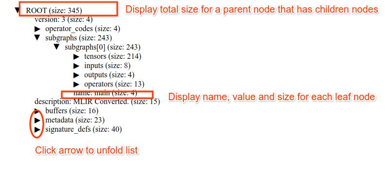

# TFLite 大小可视化工具

这是一个实验性工具，用于生成带有每个字段大小信息的 tflite 文件可视化。

每个字段的大小信息是每个字段的原始存储大小信息，不包括任何 flatbuffer 开销，如偏移表等。因此，大小信息提供了所需数据大小的下限（例如将其存储到 c 结构中），而不是将其存储为 tflite 缓冲区。

以下是您如何使用 tflite 文件的可视化

```
cd tensorflow/lite/micro/python/tflite_size/src

bazel run flatbuffer_size -- in_tflite_file out_html_file
```

示例输出 html 如下图所示 。

它显示每个字段的名称、值和大小。显示由可折叠列表组成，因此您可以根据需要放大/缩小单个结构。

## 如何更新 `schema_generated_with_reflective_type.h`

我们使用 tensorflow/lite/schema:schema_fbs_with_reflection 中的构建目标生成自己的 schema_generated_with_reflective（调用方式：bazel build schema_fbs_with_reflection_srcs）。