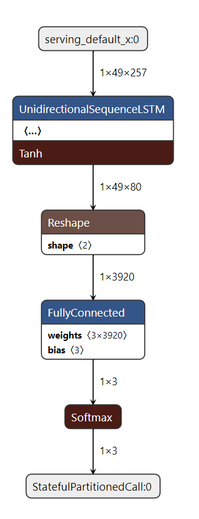
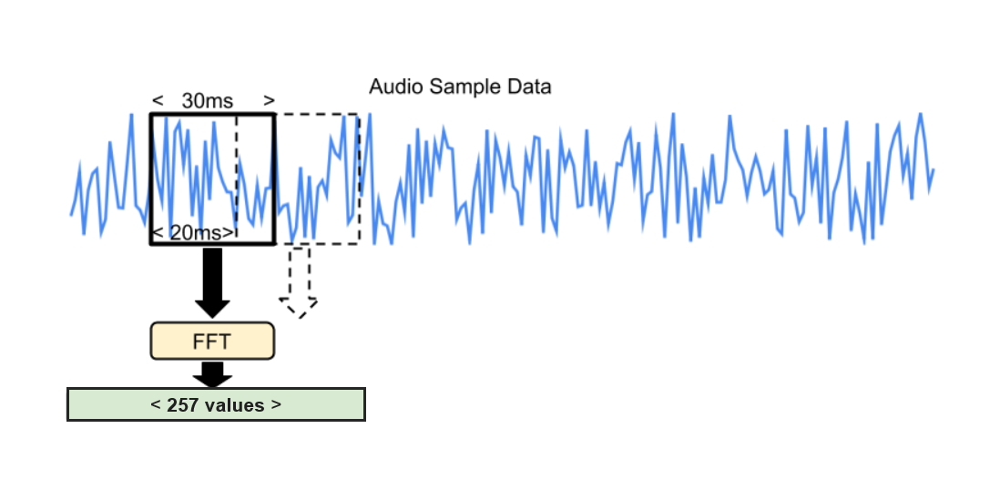

<!--ts-->
<!-- 翻译：AI助手，于 2026年5月12日 -->
<!--te-->

# 带 LSTM 的微型语音训练
# Mini Speech Training with LSTM

此示例展示如何训练一个 125 kB 的模型，该模型可以从用户选择的以下 8 个关键词中识别任意 2 个关键词，将所有其他命令分类为 "unknown" 关键词，并根据语音数据预测所选关键词。
This example shows how to train a 125 kB model that can recognize any of 2 keywords from the below 8 keywords chosen by the user,
classify all other commands as an "unknown" keyword, and predict the chosen keywords from speech data.

您可以重新训练它来识别此列表中任意组合的单词（2 个或更多）（所有其他单词将传递到 "unknown" 关键词集）：
You can retrain it to recognize any combination of words (2 or more) from this
list (all other words would be passed to "unknown" keyword set):

```
"down", "go", "left", "no", "right", "stop", "up" and "yes".
```

用于训练模型的脚本源自[简单音频识别](https://www.tensorflow.org/tutorials/audio/simple_audio)教程。
The scripts used in training the model have been sourced from the
[Simple Audio Recognition](https://www.tensorflow.org/tutorials/audio/simple_audio)
tutorial.

## 目录
## Table of contents

-   [概述](#概述)
-   [Overview](#overview)
-   [训练](#训练)
-   [Training](#training)
-   [训练好的模型](#训练好的模型)
-   [Trained Models](#trained-models)
-   [模型架构](#模型架构)
-   [Model Architecture](#model-architecture)
-   [数据集](#数据集)
-   [Dataset](#dataset)
-   [预处理语音输入](#预处理语音输入)
-   [Preprocessing Speech Input](#preprocessing-speech-input)

## 概述
## Overview

1.  数据集：[微型语音命令](http://storage.googleapis.com/download.tensorflow.org/data/mini_speech_commands.zip)
1.  Dataset: [Mini Speech Commands](http://storage.googleapis.com/download.tensorflow.org/data/mini_speech_commands.zip)
2.  数据集类型：**Mini_Speech_Commands**
2.  Dataset Type: **Mini_Speech_Commands**
3.  深度学习框架：**TensorFlow 2.5.0**
3.  Deep Learning Framework: **TensorFlow 2.5.0**
4.  语言：**Python 3.7**
4.  Language: **Python 3.7**
5.  模型大小：**<125 kB**
5.  Model Size: **<125 kB**
6.  模型类别：**多类分类**
6.  Model Category: **Multiclass Classification**

## 训练
## Training

使用 Google Colaboratory 在云端训练模型。
Train the model in the cloud using Google Colaboratory.

<table class="tfo-notebook-buttons" align="left">
  <td>
    <a target="_blank" href="https://colab.research.google.com/github/tensorflow/tflite-micro/blob/main/third_party/xtensa/examples/micro_speech_lstm/train/micro_speech_with_lstm_op.ipynb">Google Colaboratory</a>
  </td>
</table>

*预计训练时间：约 2 分钟。*
*Estimated Training Time: ~2 Minutes.*

## 训练好的模型
## Trained Models

训练生成的 flatbuffer 模型可以在[此处](../micro_speech_lstm.tflite)找到。该模型量化为 int8 精度，即所有激活和权重都是 int8。
The flatbuffer model generated as a result of the traning can be found
[here](../micro_speech_lstm.tflite). This model is quantized to int8 precision,
i.e. all the activations and weights are int8.

## 模型架构
## Model Architecture

这是一个简单的模型，包含一个单向序列 LSTM 层、一个重塑层、一个全连接层或矩阵乘法层（输出：logits）和一个 Softmax 层（输出：概率），如下所示。请参考以下模型架构。
This is a simple model comprising of a Unidirectional Sequence LSTM layer, a
Reshape layer, a Fully Connected Layer or a MatMul Layer (output: logits) and a
Softmax layer (output: probabilities) as shown below. Refer to the below model
architecture.



*此图像是通过在 [Netron](https://github.com/lutzroeder/netron) 中可视化 'micro_speech_model.tflite' 文件得到的*
*This image was derived from visualizing the 'micro_speech_model.tflite' file in
[Netron](https://github.com/lutzroeder/netron)*

这产生了一个准确率约为 93% 的模型，但它被设计为管道的第一阶段，在低能耗的硬件上运行，该硬件可以始终处于开启状态，然后在发现可能的语音时唤醒更高功率的芯片，以便进行更准确的分析。此外，模型接受预处理的语音输入，因此我们可以利用更简单的模型获得准确的结果。
This produces a model with an accuracy of ~93%, but it's designed to be used as
the first stage of a pipeline, running on a low-energy piece of hardware that
can always be on, and then wake higher-power chips when a possible utterance has
been found, so that more accurate analysis can be done. Additionally, the model
takes in preprocessed speech input as a result of which we can leverage a
simpler model for accurate results.

## 数据集
## Dataset

[微型语音命令数据集](http://storage.googleapis.com/download.tensorflow.org/data/mini_speech_commands.zip)包含超过 8,000 个 WAVE 音频文件，人们说着 8 个不同的单词。这些数据由 Google 收集，并在 CC BY 许可下发布。您可以通过贡献五分钟自己的声音来帮助改进它。存档超过 2GB，因此这部分可能需要一些时间，但您应该会看到进度日志，并且一旦下载完成，您就不需要再次执行此操作。
The [Mini Speech Commands Dataset](http://storage.googleapis.com/download.tensorflow.org/data/mini_speech_commands.zip)
consists of over 8,000 WAVE audio files of people saying 8 different words. This
data was collected by Google and released under a CC BY license. You can help
improve it by contributing five minutes of your own voice. The archive is over
2GB, so this part may take a while, but you should see progress logs, and once
it's been downloaded you won't need to do this again.

## 预处理语音输入
## Preprocessing Speech Input

在本节中，我们讨论频谱图，即模型的预处理语音输入。以下是该过程的图示：
In this section we discuss spectrograms, the preprocessed speech input to the
model. Here's an illustration of the process:



模型不接受原始音频样本数据，而是使用频谱图，这些频谱图是由不同时间窗口获取的频率信息切片组成的二维数组。
The model doesn't take in raw audio sample data, instead it works with
spectrograms which are two dimensional arrays that are made up of slices of
frequency information, each taken from a different time window.

创建频谱图数据的方法是：通过对音频样本数据的 30ms 部分运行 FFT 来创建每个频率切片。输入样本被视为介于 -1 和 +1 之间的实数值（在 16 位有符号整数样本中编码为 -32,768 和 32,767）。
The recipe for creating the spectrogram data is that each frequency slice is
created by running an FFT across a 30ms section of the audio sample data. The
input samples are treated as being between -1 and +1 as real values (encoded as
-32,768 and 32,767 in 16-bit signed integer samples).

这导致 FFT 有 257 个条目。
This results in an FFT with 257 entries.

在完整的应用程序中，这些频谱图将在运行时从麦克风输入计算，但执行此操作的代码尚未包含在此示例代码中。测试使用已从一秒 WAV 文件预先计算的频谱图。
In a complete application these spectrograms would be calculated at runtime from
microphone inputs, but the code for doing that is not yet included in this
sample code. The test uses spectrograms that have been pre-calculated from
one-second WAV files.