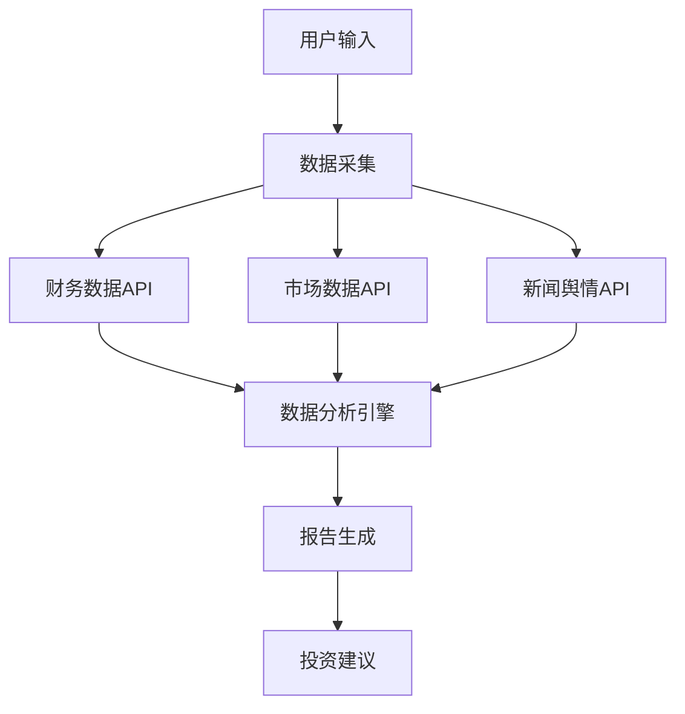

# AI Berkshire 技能：投资研究AI助手

> 来源：微信公众号「JackCui」- 投资研究AI助手相关文章
> 原文链接：https://mp.weixin.qq.com/s/rN6gmls_hbTWVHHSDhN3-Q
> 收录日期：2026-07-06

## 概述

**AI Berkshire** 是一个专为投资研究设计的AI Agent技能集合，提供了一套完整的投资分析工作流，帮助投资者进行深度研究和决策支持。

## 技能集合

### 核心技能

#### 1. **investment-research** - 投资研究
**功能**：对特定公司或行业进行深度投资研究分析
**使用示例**：
- Claude Code: `/investment-research 腾讯`
- Codex: `使用 investment-research 研究 腾讯`
- Codex（带Slash Prompts）: `/prompts:investment-research 腾讯`

**输出内容**：
- 公司基本面分析
- 行业竞争格局
- 财务数据解读
- 风险因素评估
- 投资建议总结

#### 2. **investment-team** - 投资团队分析
**功能**：分析投资团队或基金公司的背景、业绩、策略
**使用示例**：
- Claude Code: `/investment-team 美团`
- Codex: `使用 investment-team 分析 美团`

**输出内容**：
- 团队背景和经验
- 历史投资业绩
- 投资策略和风格
- 管理规模和资金流向
- 团队稳定性评估

#### 3. **earnings-review** - 财报回顾
**功能**：深入分析公司财报，提取关键信息和趋势
**使用示例**：
- Claude Code: `/earnings-review 腾讯 2025Q4`
- Codex: `使用 earnings-review 分析 PDD 2025年报`
- Codex: `使用 earnings-review 分析 腾讯 2025Q4`

**输出内容**：
- 关键财务指标分析
- 营收和利润增长趋势
- 现金流状况
- 资产负债表健康度
- 管理层讨论与分析摘要
- 未来展望和市场预期

#### 4. **industry-funnel** - 行业漏斗分析
**功能**：对特定行业进行筛选和分层分析
**使用示例**：
- Claude Code: `/industry-funnel AI算力`
- Codex: `使用 industry-funnel 筛选 AI算力`

**输出内容**：
- 行业市场规模和增长趋势
- 产业链上下游分析
- 关键参与者和竞争格局
- 技术发展和创新趋势
- 政策和监管环境
- 投资机会和风险点

#### 5. **portfolio-review** - 投资组合回顾
**功能**：分析投资组合表现和优化建议
**使用示例**：
- Claude Code: `/portfolio-review 腾讯30%, 美团20%, 茅台20%, 现金30%`
- Codex: `使用 portfolio-review 分析当前持仓`

**输出内容**：
- 资产配置分析
- 风险和收益评估
- 相关性分析
- 再平衡建议
- 压力测试结果
- 优化方案推荐

## 技术架构

### 数据处理流程

### 数据源集成
1. **财务数据**：财报、年报、季报
2. **市场数据**：股价、成交量、市值
3. **行业数据**：市场规模、竞争格局
4. **新闻舆情**：媒体报道、分析师报告
5. **宏观数据**：经济指标、政策变化

## 应用场景

### 1. 个人投资者
- **快速研究**：快速了解公司和行业基本面
- **投资决策**：基于数据的投资决策支持
- **组合管理**：定期检视和优化投资组合

### 2. 专业分析师
- **自动化研究**：自动化收集和分析数据
- **报告生成**：快速生成投资研究报告
- **趋势发现**：识别行业趋势和投资机会

### 3. 机构投资者
- **团队协作**：标准化投资研究流程
- **风险管理**：系统化风险评估
- **绩效评估**：量化投资组合表现

## 优势特点

### 1. **全面性**
- 覆盖公司、行业、宏观多维度分析
- 整合财务、市场、舆情多源数据
- 提供从研究到决策的完整工作流

### 2. **智能化**
- AI驱动的数据分析和模式识别
- 自动化报告生成和摘要
- 个性化投资建议

### 3. **实用性**
- 简洁的命令行接口
- 结构化输出便于后续处理
- 支持多种AI平台适配

### 4. **可扩展性**
- 模块化设计，易于添加新功能
- 支持自定义数据源集成
- 可与其他金融工具集成

## 安装与配置

### 支持平台
1. **Claude Code**：原生支持，通过 `/` 命令调用
2. **Codex**：通过自然语言或Slash Prompts调用
3. **其他AI平台**：需要适配Skill格式

### 安装方式
1. **GitHub仓库**：待作者公开
2. **依赖环境**：
   - Python 3.8+
   - 金融数据API访问权限
   - AI平台支持Skills功能

### 配置要点
1. **API密钥配置**：配置财务数据、市场数据API
2. **偏好设置**：投资风格、风险偏好、关注领域
3. **输出格式**：报告格式、详细程度、语言

## 使用建议

### 最佳实践
1. **逐步深入**：从行业分析到具体公司研究
2. **交叉验证**：结合多个技能进行综合分析
3. **定期更新**：保持数据和观点的时效性
4. **风险管理**：结合风险分析进行决策

### 注意事项
1. **数据质量**：依赖数据源的准确性和完整性
2. **模型局限**：AI分析可能存在偏差，需人工验证
3. **风险提示**：投资有风险，分析仅供参考

## 未来发展方向

1. **数据源扩展**：集成更多数据源和分析工具
2. **算法优化**：提升分析准确性和深度
3. **用户体验**：更友好的界面和交互方式
4. **协作功能**：团队协作和研究共享
5. **移动端支持**：随时随地获取投资洞察

## 相关资源

### 学习资料
- 投资分析基础教程
- 财务报表解读指南
- 行业研究方法论
- 投资组合管理理论

### 工具集成
- 财务分析工具
- 数据可视化工具
- 风险管理工具
- 投资组合优化工具

### 社区支持
- GitHub Issues和讨论
- 用户交流群组
- 定期更新和维护

---

**标签**：`#investment-research` `#financial-analysis` `#ai-assistant` `#portfolio-management` `#automation`