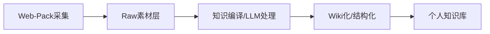

# Web-Pack 技能：网页素材包采集

> 来源：微信公众号「Ai学习的老章」-《搭建个人知识库，分享一个我原创的 Skills》
> 原文链接：https://mp.weixin.qq.com/s/U1nICI87xfBZ86Bh_Dj5kw
> 收录日期：2026-07-06

## 概述

**Web-Pack** 是一个专门用于采集网页主题完整素材包的AI Agent技能，旨在超越传统网页剪藏工具，解决个人知识库搭建中"原始素材(Raw层)"采集问题。

## 设计目标

解决传统剪藏工具（如Obsidian Web Clipper）在保存网页内容时的痛点：
- **信息丢失**：只保存片段，缺乏上下文
- **图片外链易失效**：依赖外部图床
- **缺乏结构化组织**：单页孤岛，无关联关系
- **深度不足**：只抓表面，无法获取相关链接内容

## 核心功能流程

1. **深度采集**：接收一组同主题链接，AI Agent会逐个深入阅读入口链接的正文
2. **链接展开**：自动识别并递归抓取正文中相关的有价值链接（如论文、GitHub仓库、官方文档等）的内容
3. **智能过滤**：只采集正文、表格、图片、代码等核心内容，自动跳过侧边栏、广告、页脚等噪音
4. **图片本地化**：将所有正文中的图片下载到本地文件夹，并在生成的Markdown文件中使用相对路径引用，彻底解决外链失效和防盗链问题
5. **结构化输出**：自动生成一个结构清晰、包含索引和关联关系的素材包文件夹

## 输出文件夹结构

```
YYYY-MM-DD-主题名/
├── README.md              # 素材包概览
├── 00-research-brief.md   # 研究简报
├── 01-link-inventory.md   # 链接清单（全量）
├── 02-image-inventory.md  # 图片清单
├── 03-reading-map.md      # 阅读地图（关系图）
├── MAIN-01-入口正文.md     # 入口页面正文
├── LINKED-02-相关链接.md   # 正文中展开的相关链接
└── assets/                # 本地图片资源
```

## 关键技术策略

### 分层抓取策略（多层兜底机制）
1. **常规HTTP抓取**（优先）
2. **GitHub链接优化**：使用GitHub API或raw文件
3. **直接保存**：Markdown、JSON、纯文本文件
4. **兜底方案**：使用 `jina` (Jina Reader) 作为最后手段

### 智能链接判断规则
- **优先展开**：
  - 官方文档、博客、论文、GitHub仓库
  - README文件、与主题相关的评测、数据、示例代码
- **直接跳过**：
  - 导航菜单、广告、社交分享链接
  - 登录/注册页、Logo/头像等装饰性图片

### 完整性检查
收尾阶段自动检查是否有非自有图床的外链图片残留，并可调用其他图床上传技能处理。

## 使用方式

### 调用方式
直接对AI Agent说："**帮我采集这几个链接的素材**"，Agent会自动识别并调用该技能。

### 关键控制参数
- `--max-depth 1`：默认推荐，抓取入口页面及其正文中的一级相关链接
- `--max-depth 2`：需要深度挖掘时使用
- `--max-pages 80`：控制总抓取页面数，防止无限递归
- `--same-domain-only`：仅采集同一域名下的内容

## 适用场景

1. **技术调研**：收集某个技术栈的所有相关文档
2. **竞品分析**：采集竞品官网、文档、博客文章
3. **学术研究**：收集论文、实验数据、参考文献
4. **市场分析**：采集行业报告、新闻、数据统计
5. **个人知识库构建**：为Karpathy提出的"LLM Wiki"个人知识库提供高质量Raw层素材

## 与现有知识库工作流整合



## 核心价值

1. **完整保留**：不只是"剪藏"，而是"采集"完整素材包
2. **本地化存储**：所有资源本地化，避免外链失效
3. **结构化组织**：自动生成关联关系和导航结构
4. **节省时间**：自动化收集和整理，减少手动操作
5. **支持后续处理**：为LLM知识编译提供高质量的输入材料

## 安装与配置

> 注：这是一个开源AI Agent技能，需要根据具体AI平台（Claude Code/Codex/CodeBuddy等）进行适配安装。

**GitHub仓库**：待作者公开
**适配平台**：支持所有支持Skill格式的AI Agent平台

## 相关技能

- **Karpathy编码准则**：已实现，位于 `karpathy-guidelines/`
- **Brainstorming**：已实现，位于 `brainstorming/`
- **Writing Plans**：已实现，位于 `writing-plans/`

## 作者信息

- **作者**：老章（公众号：Ai学习的老章）
- **发布时间**：2026-06-06
- **技能类型**：原创AI Agent技能
- **应用领域**：知识管理、信息采集、内容整理

---

**标签**：`#web-crawling` `#knowledge-management` `#content-collection` `#ai-agent` `#automation`